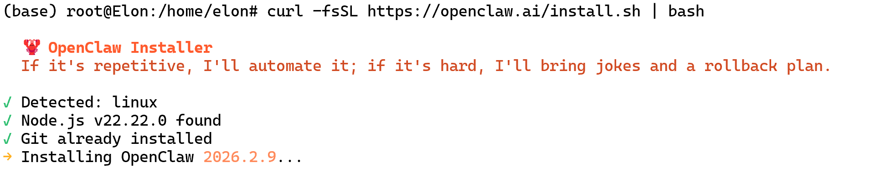

## 环境准备

Windows系统前置要求：

安装WSL子系统（推荐Ubuntu-24.04版本）
管理员身份运行PowerShell
执行命令：wsl --install -d Ubuntu-24.04
重启系统后创建用户账户（密码输入时终端无显示）

## 依赖组件安装

- 系统更新：`sudo apt update && sudo apt upgrade -y`
- 安装Node.js
- 安装Git

## 安装openclaw

- 启动WSL中的Linux，输入`curl -fsSL https://openclaw.ai/install.sh | bash`，过程预计几分钟。



- 忽略风险继续安装，并选择快速启动。


- 配置AI大模型。
- 技能配置：可以先选"Skip for now"
- Hook设置：必须勾选"boot-md"以实现记忆功能
- 交互方式：WebUI或命令行。

## 使用openclaw

// 在这步开始失败

- 也许是gemini没有使用付费层级；
- 网络配置问题；


### 接入Telegram

### 接入飞书

- 飞书开发平台
- 略

## 卸载

```
openclaw uninstall  // 没有卸载CLI
npm rm -g openclaw  // 卸载CLI
```