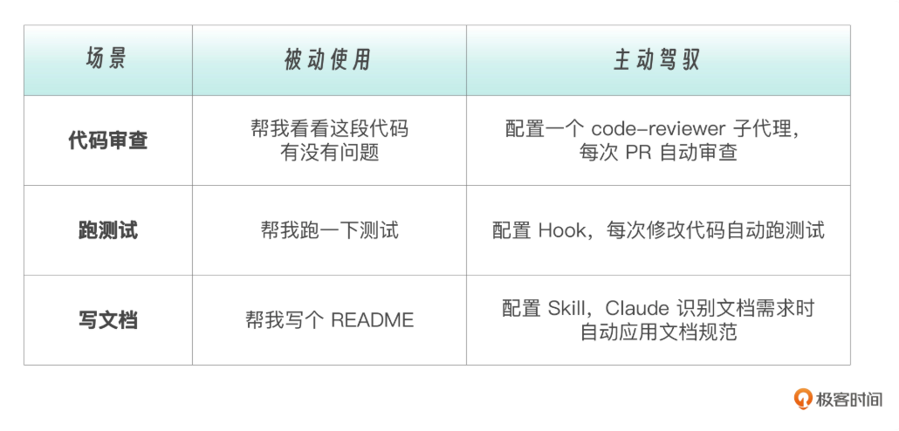
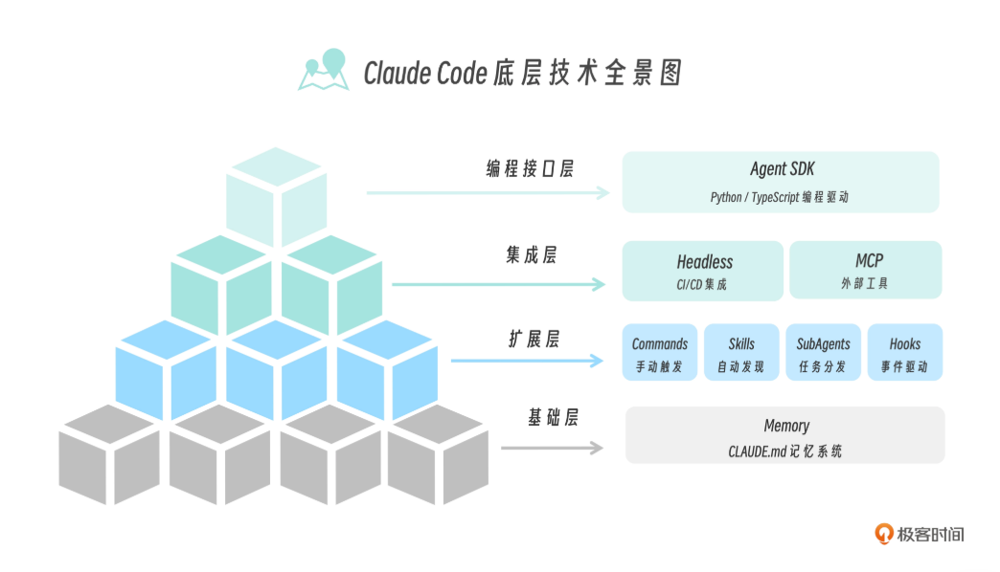
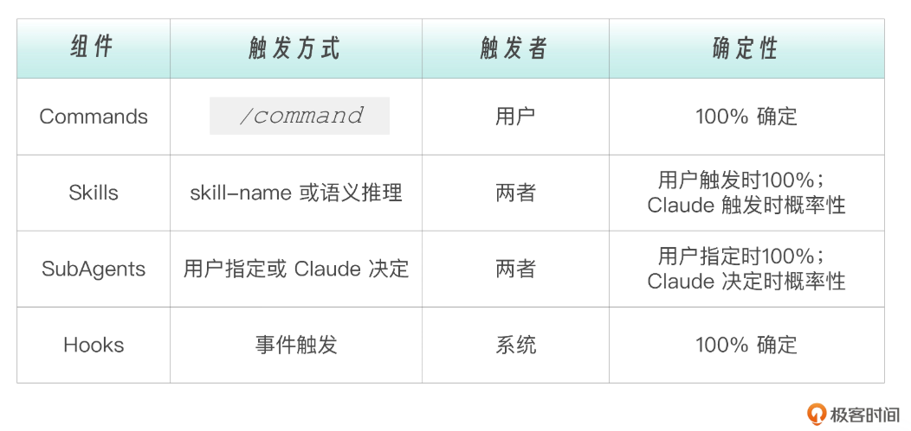

AI编程工具，包括但不限于Claude Code、Codex、Cursor、Copilot、Windsurf等，都属于Agent的一员。就像VS Code不仅是个编辑器，还是一个扩展平台，智能体也是一个可扩展、可定制的综合体。

AI 智能体有多种使用方式，可以在浏览器中使用，也可以在本地安装使用，智能体可以作为一个服务来运行，有IDE、CLI和IDE插件等使用方式。无论在本地还是浏览器使用，一般都有ask、plan、agent（code）等多种模式。

AI编程工具的安装和配置不难，你不妨先体验一下各种使用方式，在对话框中输入问题，由Agent回答问题或编写代码。然而，仅仅体验远远不够，通过了解各种底层技术，你可以让智能体成为你的专属工具，解决你专属的问题。



## Agent框架



### 基础层（Memory.md）

基础层是AI agent的长期记忆系统，核心是一份.md格式的文档。在Claude中，该文档的命名为CLAUDE.md，在Codex中命名为Agent.md，在OpenClaw中为SOUL.md、MEMEORY.md、Identity.md等，其它智能体都大同小异。

记忆文件具有不同的层级，全局、项目和项目的特定模块都可以有不同的记忆文件。这些文档是智能体长期记忆的载体，你可以在里面写下一些通用的项目规范、技术栈、项目的背景和目标、代码风格和规范等。

在每轮对话中，记忆文件作为System Prompt存在，不会被上下文压缩，因此必须要简洁有效。

虽然系统可以生成默认的记忆文件，但是在编写个人项目时，还是强烈建议创建一个记忆文件。以下是一个个人博客项目的Memory.md内容：

```markdown
# Project: personal academic blog

## Introduction
- ... 

## Technology Stack
- astro
- island architecture
- tailwind css
- Cult UI
- ...

## Code Sytle
- function length (max 5 lines)
- line length (max 120 characters)
- component-based design principles

## Rules
- tests first
- no comments to main directly
- no exceptions
- ...
```

task: 尝试书写项目Agent.md，需要参考记忆文件中的内容，需要体现项目的特点。

### 扩展层

在真实的系统种，各个组件相互协作，共同完成复杂任务。

如果你需要“每次都必须执行”的操作（比如代码格式化），你需要  100% 确定性——选择 Commands 或 Hooks。如果你希望 Claude “智能判断何时使用”（比如识别到安全问题时自动深入分析），你可以接受概率性——选择 Skills。如果任务可能很重，你希望“既可以手动触发，也可以让 Claude 自己决定”，你需要可控性——选择 SubAgents。



#### Commands

ai编程工具会内置部分核心能力，通过手动输入`/`选择来触发，比如`/plan`可以触发智能体的计划能力。

用户也可能根据自身需求，将适合标准化操作的task编写成固定的Commands，比定义`/commit`命令来约束团队的提交格式。

task: 查看某个agent的文档，尝试运行各个command。

#### Skills

如下是一份Skill的内容：

```markdown

```

如memory.md一样，skill也是一个md文档，文档内部描述了agent拥有的能力，以及使用方法和注意事项。

与Tools相比，Tools是函数调用，而Skill封装了条件判断、提示词、策略和调用顺序等，Tools仅仅是Skill的一种参数。

Skill不是固定化的标准执行流程，而是具备强烈的“领域感”（安全、架构、性能）的专家判断，依赖上下文而非关键词，Agent会自动判断（语义推理）是否激活相应技能。

Agent内部内置了创建skill的skill，你可以自定义一个skill，也可以让Agent去学习，自动创建skill。

task：阅读skill，尝试编写自己的skill。


#### SubAgent

子代理解决agent系统规模膨胀的问题，单一的agent上下文无法承载过多的权限和职责。

因此，复杂任务需要拆解为简单任务，每个任务交给一个sub agent来完成，每个sub agent具有独立的职责和受限的权限。SubAgents 适合隔离执行——高噪声任务（比如在大量日志中寻找出错信息，在大量文档中检索相关资源）、需要特定权限的任务。

其触发方式可以由 Claude 决定或用户指定。


#### Hooks

钩子是在特定事件触发时自动执行的脚本，监控所有工具调用。其触发方式是事件自动触发，适合自动化检查——格式化、安全检查、日志记录等。

### 继承层

负责链接外部世界

#### Headless

无头模式让 Claude Code 在没有人工交互的情况下运行，适合  CI/CD 集成——自动代码审查、自动修复、自动生成变更日志等。

#### MCP(Model Context Protocol  )

连接外部工具和服务，适合工具连接——可以把任何外部系统变成 Claude 可调用的工具。

### 编程接口层（Agent SDK）

当配置式的扩展不够用时，你可以用代码来驱动 Claude。这种方式适合构建自定义 Agent——完全控制执行流程、自定义工具、复杂工作流。

## Plugin

```markdown
my-team-plugin/
├── commands/           # 斜杠命令
│   └── review.md
├── skills/             # 技能
│   └── security-check/
│       └── SKILL.md
├── agents/             # 子代理
│   └── test-runner.md
├── hooks/              # 钩子
│   └── pre-edit.sh
└── plugin.json         # 插件配置
```


